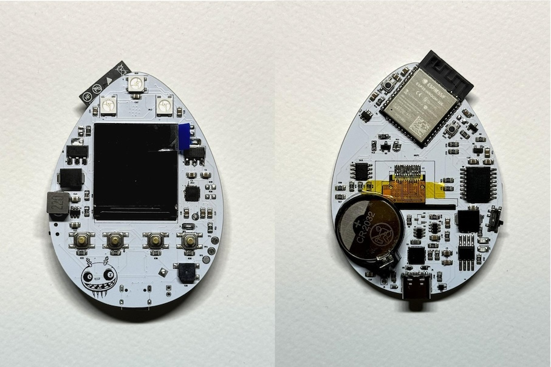

# EggSP32-Tama - A real Tamagotchi emulator for ESP32 based on ArduinoGotchi

## Credits
I started this firmware from the [RBEGamer/TamagotchiESP32](https://github.com/RBEGamer/TamagotchiESP32), Which is a fork of a fork of [ArduinoGotchi](https://github.com/GaryZ88/ArduinoGotchi).\
\
I did not clone the the repository I started from due to the following reason:
- The original repo contained a file I don't want to include in this repo (rom_12bit.h). 
- I used a different hardware and RBEGamer had a hardware folder not relevant for my repo
- I did substantial changes in how I used tamalib, so this will never be merged with the original repository

## EggSP32

I designed a board that I called EggSP32 and I ported the game for my board and display.
This is the boards:
 \
Board description: [reddit post](https://www.reddit.com/r/esp32/comments/1ehskpr/eggsp32_custom_esp32_devboard/)
\
After designing the board, I needed a software, so I decided to start from the ArudinoGotchi modified for ESP32.

## Synopsis from ArduinoGotchi

**ArduinoGotchi** is a real [Tamagotchi P1](https://tamagotchi.fandom.com/wiki/Tamagotchi_(1996_Pet)) emulator running in Arduino UNO hardware. The emulation core is based on [TamaLib](https://github.com/jcrona/tamalib) with intensive optimization to make it fit into UNO's hardware that only comes with 32K Flash 2K RAM.

## Improvements over the original ArduinoGotchi and RBEGamer version

I added a few changes over the original repo to fit my needs:

* Firmare developed only for `ESP32` platform. I removed other MCU support
* Replaced display library to TFT_eSPI library for a 240x240 ST7789 LCD
* Upscaled the graphics for the high-res display.

## Build

### Firmware

First, install Visual Code and the PlatformIO plugin.
Open the `EggSP32-Tama` folder as `Workspace-Folder`

Open the Platformio by clicking on the Icon on the left sidebar.
Select *EggSP32-Tama* and use the `build` task, Next run `Upload` or `Upload and Monitor` to upload the firmware to the connected board.

## Game notes

- To activate your pet, you have to configure the clock by pressing the middle button. Otherwise, your pet will not alive.
- A long click on "middle" button for 5 seconds, will reset memory back to egg state
- A long click on "left" button for 5 seconds, will enter the deepsleep mode for 10 minutes

### License
The base project ArduinoGotchi is distributed under the GPLv2 license. See the LICENSE file for more information.
